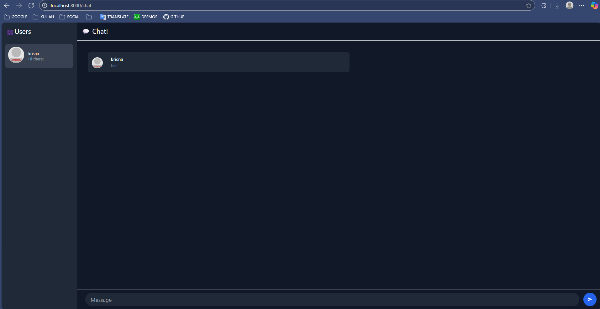

| NAME               | ID         | ADVPROG CLASS |
| ------------------ | ---------- | ------------- |
| Sultan Ibnu Mansiz | 2306275840 | B             |

# Module 10: Asynchronous Programming - Web Chat

## Original Code

After running `npm start` on YewChat and the Simple WebSocket Server, we can see that YewChat functions properly. We are able to send and receive messages in the chat room.

## Add Some Creativities to WebChat

For this part, I created a Dark Mode version of Yew WebChat. What I did was change the light colors to dark colors.
